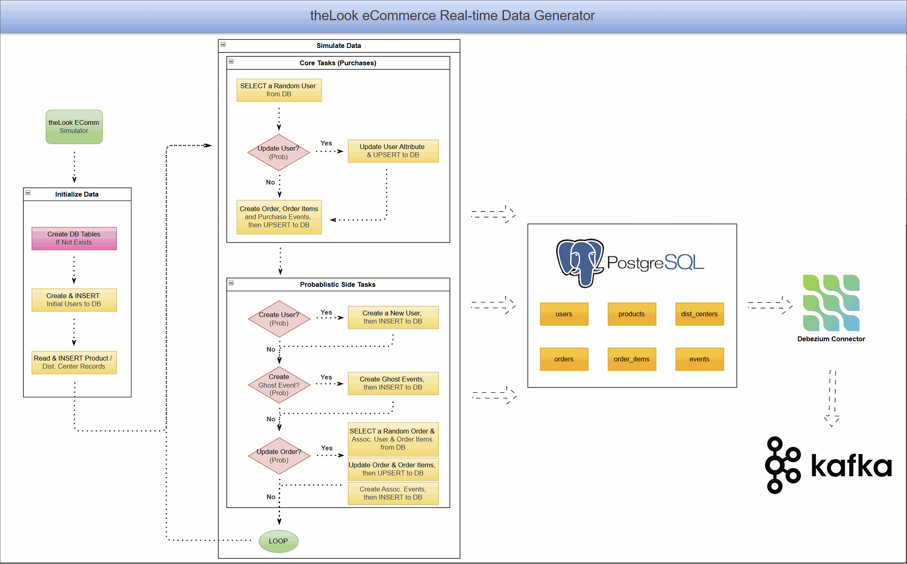

# Real-Time theLook eCommerce Data Generator

This project provides a real-time data generator that simulates user activity for an e-commerce platform. It is a significant update and re-engineering of the original [theLook eCommerce dataset](https://console.cloud.google.com/marketplace/product/bigquery-public-data/thelook-ecommerce). 

While the original dataset is static and designed for batch analytics, this generator provides a **continuous, real-time stream of data** inserted directly into a PostgreSQL database. This makes it an ideal source for Change Data Capture (CDC) pipelines (e.g., using Debezium and Kafka) to model and test modern, event-driven data architectures.



---

## 🎯 Current State & Data Integrity (Why this version is better)

The generator has been heavily refactored to ensure **high business data integrity**, moving away from a "random fake data demo" to a robust source capable of testing actual downstream transformations:

### 1. Strict Relational Mapping
- **Orders & Users:** Every new `order` maps to a legitimate, existing `user` in the database.
- **Order Items:** `order_items` correctly inherit the `order_id` and `user_id` from their parent order.
- **Products:** The `product_id` assigned to an order item is strictly chosen from a valid catalog (`PRODUCT_MAP`) seeded initially.
- **Inventory Allocation:** When a purchase occurs, an actual `inventory_item_id` is allocated. If a product runs out of stock, the system auto-replenishes it.

### 2. Transactional Safety (Atomic Bundles)
Instead of executing disparate commits, the generator now bundles **`orders + order_items + events + inventory updates` into a single database transaction**. This drastic improvement eliminates the risk of "orphaned" or partial data if the script crashes midway.

### 3. Safe ID Allocation
The generator no longer uses purely random Primary Keys (which risked `upsert` collisions and overwriting historical data). IDs for `users`, `orders`, `order_items`, and `events` are now sequentially allocated by looking up `max(id)` in the DB at runtime.

### 4. Sanitized Clickstream
- The dedicated `events-only` script no longer generates fake "business" events (`purchase`, `cancel`, `return`) for browsing sessions that lack an actual order context.
- Anonymous browsing ("ghost events") in the main generator has been sanitized and properly assigned sequential IDs.

### 5. Database-Level Schema Enforcement (DDL Constraints)
Integrity isn't just maintained by Python logic; it is **enforced by PostgreSQL**. The DDL definition in `models.py` has been tightened with:
- **Foreign Keys (FK):** `products -> distribution_centers`, `inventory_items -> products / distribution_centers`, `orders -> users`, `order_items -> orders / users / products / inventory_items`, `events -> users`.
- **Check Constraints:** 
  - Prices/costs (`cost`, `retail_price`, `sale_price`) and item counts must be >= 0.
  - Logical timestamp sequencing: `updated_at >= created_at`, `shipped_at >= created_at`, `delivered_at >= shipped_at`, `returned_at >= delivered_at`.
  - Valid string enums for `status` (orders) and `event_type`.

*This ensures that bad data is blocked at the source DB, rather than polluting the CDC stream.*

---

## 🚀 Setup & Usage

### Prerequisites
- Python 3.8+
- A running PostgreSQL instance
- `make` utility installed

### Installation
1. Create and activate a virtual environment:
   ```bash
   python -m venv venv
   source venv/bin/activate
   ```
2. Install dependencies:
   ```bash
   pip install -r datagen/thelook-ecomm/requirements.txt
   ```

### Running via Makefile (Recommended)
We provide helpful Make commands to manage the data generation lifecycle safely:

- **Reset and Seed (Clean Start):**
  Truncates the source schema, loads the base CSV snapshots (products, distribution centers, initial users), and starts generating data from a clean slate.
  ```bash
  make reset-seed-gendata
  ```

- **Resume Generation:**
  Continues generating data on top of the existing database without resetting. Safe to use if you just stopped the script and want to resume.
  ```bash
  make resume-gendata
  ```

### Manual CLI Options

If you prefer to run the script manually to override parameters:

```bash
python datagen/thelook-ecomm/data_generator.py --help
```

**Common Options:**
- `--avg-qps`: Average events per second to simulate (paces the loop).
- `--init-num-users`: Initial number of users to seed (if initializing).
- `--user-create-prob` / `--user-update-prob` / `--order-update-prob` / `--ghost-create-prob`: Probabilities for side-tasks occurring after a main purchase event.
- DB Credentials: `--host`, `--user`, `--password`, `--db-name`, `--schema`.

---

## ⚙️ Core Simulation Logic

The main event loop continuously generates data paced by an exponential variate (`random.expovariate(avg_qps)`) to create realistic, variable delays.

1. **Purchases (Main Task):**
   - Picks a random user.
   - May update their address probabilistically.
   - Creates an `Order` (Processing), multiple `OrderItems` (tied to real products and inventory), and a sequence of `Events` mimicking the user journey (home -> department -> product -> cart -> purchase).
   - Writes everything in **one transaction**.

2. **Probabilistic Side Tasks:**
   - **New Users:** Occasionally creates fresh users.
   - **Ghost Events:** Simulates anonymous browsing sessions.
   - **Order Updates:** Selects historical orders and advances their status (e.g., Processing -> Shipped -> Delivered -> Returned). Updates items and fires corresponding events.

---

## ⚠️ Known Limitations & Future Work
While highly robust, a few areas remain for future refinement:
1. **Concurrency Scaling:** Currently, the generator uses a shared connection pool and `asyncio.to_thread`. If scaling to multiple concurrent worker processes, higher transaction isolation levels might need to be evaluated.
2. **Model Constructors:** Internal classes like `Order.new()` still initially assign a random ID before the allocator overrides it right before insertion. A cleaner design would decouple IDs from the constructor entirely.
3. **Advanced Business Logic:** Product selection inside an order is purely random. It doesn't yet simulate human behavior like avoiding duplicate identical items in the same cart, or clustering items by category.


Viewed README.md:1-10
Listed directory thelook-ecomm
Listed directory src
Viewed generator.py:1-602
Viewed models.py:1-589
Viewed db_writer.py:1-168

Chào bạn, mình đã đọc và phân tích kỹ lưỡng các file code chính trong thư mục `datagen/thelook-ecomm/` (`generator.py`, `models.py`, `db_writer.py`). 

Dưới đây là phần trình bày chi tiết về kiến trúc, luồng hoạt động, những điểm sáng giá về mặt thiết kế (đặc biệt là tính toàn vẹn dữ liệu) và một số nhận xét về kỹ thuật để có thể tối ưu thêm trong tương lai.

---

### 1. Kiến trúc tổng thể (Architecture)

Chương trình được thiết kế theo mô hình **OOP (Object-Oriented Programming)** kết hợp với **Asynchronous I/O (`asyncio`)** để giả lập luồng sự kiện thời gian thực.
*   **`TheLookECommSimulator` (`generator.py`):** Bộ não trung tâm. Chịu trách nhiệm quản lý vòng lặp thời gian thực, điều phối tỷ lệ sinh dữ liệu (QPS), phân bổ ID tuần tự và xử lý lỗi kết nối.
*   **Các Data Models (`models.py`):** Sử dụng `dataclasses` để định nghĩa cấu trúc của `User`, `Order`, `OrderItem`, `Event`. Chứa logic sinh dữ liệu ngẫu nhiên (dùng thư viện `Faker`) và đặc biệt là định nghĩa cấu trúc DDL (lệnh tạo bảng) với các ràng buộc khắt khe.
*   **`DataWriter` (`db_writer.py`):** Lớp giao tiếp với cơ sở dữ liệu PostgreSQL qua `SQLAlchemy` và `psycopg2`. Xử lý việc `upsert` dữ liệu theo lô (batch) và quản lý Transaction (Commit/Rollback).
*   **`IdAllocator`:** Cấp phát ID nội bộ tăng dần để tránh trùng lặp.

---

### 2. Luồng hoạt động chính (Simulation Flow)

Vòng lặp chính nằm ở hàm `run()` trong `generator.py`:
1.  **Pacing (Định thời):** Dùng `random.expovariate(avg_qps)` để tính toán thời gian chờ giữa các lần sinh dữ liệu, tạo ra luồng sự kiện ngẫu nhiên nhưng vẫn bám sát cấu hình trung bình (ví dụ: 20 request/giây).
2.  **Main Task (`_simulate_purchases`):**
    *   Lấy ngẫu nhiên 1 User có sẵn từ DB.
    *   Có xác suất nhỏ sẽ update địa chỉ của User này.
    *   Tạo ra 1 `Order` mới (trạng thái Processing) và $N$ `OrderItems`.
    *   Sinh ra luồng Clickstream Events (Home -> Dept -> Product -> Cart -> Purchase).
    *   Ghi toàn bộ vào DB trong **1 Transaction duy nhất**.
3.  **Side Tasks (`_simulate_side_tasks`):** Xảy ra theo xác suất cấu hình:
    *   Tạo User mới.
    *   Tạo Ghost Events (phiên lướt web ẩn danh không mua hàng).
    *   Update trạng thái đơn hàng cũ (Processing -> Shipped -> Delivered -> Returned).

---

### 3. Những điểm xuất sắc về Tính toàn vẹn Dữ liệu (Data Integrity)

So với các script tạo dữ liệu rác thông thường, phiên bản này đã đạt mức độ **Production-level Mocking**:

*   **Atomic Transactions (Giao dịch nguyên tử):** Trong hàm `_persist_purchase_bundle` (`generator.py` dòng 255), `Order`, `OrderItems`, và `Events` được đưa vào các lệnh UPSERT với `commit=False`. Phải đến cuối cùng hàm mới gọi `self.writer.commit()`. Nếu có lỗi giữa chừng, nó gọi `rollback()`. Điều này dập tắt hoàn toàn tình trạng mồ côi (có OrderItem nhưng mất Order).
*   **Xử lý Tồn kho (Inventory Allocation) chuẩn xác:** Ở hàm `_allocate_inventory_item`, chương trình dùng `FOR UPDATE` để lock row tồn kho trong PostgreSQL. Nếu kho hết hàng, nó tự động gọi `_new_inventory_row` để bổ sung (auto-replenish) rồi mới gán `sold_at`. Điều này mô phỏng rất thực tế nghiệp vụ Ecommerce.
*   **PostgreSQL DDL Constraints:** Trong `models.py`, các DDL không chỉ định nghĩa kiểu dữ liệu mà còn cài cắm hệ thống phòng thủ vững chắc:
    *   **Foreign Keys (FK):** Ràng buộc chặt chẽ quan hệ (ví dụ: `fk_order_items_product`, `fk_events_user`).
    *   **Check Constraints:** Chặn giá trị âm (`chk_products_non_negative_prices`), chặn mốc thời gian phi lý (`chk_orders_delivered_after_shipped`), và chặn event rác (`chk_events_type_valid`).
*   **Phân bổ ID An toàn:** Dùng `IdAllocator` được khởi tạo từ `max(id)` trong DB. Chặn đứng lỗi PK Collision khi chạy lại script nhiều lần.

---

### 4. Đánh giá kỹ thuật & Các điểm cần lưu ý (Tech Review & Improvements)

Mặc dù logic nghiệp vụ rất tốt, về mặt kỹ thuật lập trình (Engineering), có một số điểm có thể gây lỗi tiềm ẩn khi Scale lên (nhiều worker) hoặc chạy tải cao:

#### a. Thread Safety của Database Connection
*   **Vấn đề:** Lớp `DataWriter` khởi tạo duy nhất 1 connection (`self.conn`). Tuy nhiên, trong hàm `_simulate_side_tasks`, bạn dùng `asyncio.gather(*side_tasks)` kết hợp `asyncio.to_thread` để gọi hàm `upsert` song song. Việc nhiều thread cùng đẩy dữ liệu qua 1 connection SQLAlchemy/psycopg2 không được thiết kế cho multi-threading có thể dẫn đến lỗi "Transaction in progress" hoặc deadlock.
*   **Đề xuất:** Nên chuyển sang dùng Connection Pool (như `SQLAlchemy QueuePool` hoặc thư viện async thuần như `asyncpg`). Mỗi side task nên lấy một connection riêng biệt từ Pool, thực thi rồi trả lại.

#### b. Thiết kế "Leak Logic" ở Event Ghost
*   **Vấn đề:** Trong `models.py` dòng 474, hàm `Event.new` dành cho `ghost` sinh ra các event ngẫu nhiên bao gồm cả `purchase`, `cancel`, `return`. Sau đó ở `generator.py` dòng 100, hàm `_sanitize_browsing_events` lại phải lặp qua mảng event để ép các event này thành `product`. 
*   **Đề xuất:** Thay vì sinh ra rồi sửa lại, nên chặn ngay từ gốc. Ở `models.py`, list `event_types` cho ghost chỉ nên chứa `['home', 'department', 'category', 'product', 'cart']`.

#### c. Constructor sinh Random ID thừa
*   **Vấn đề:** Trong hàm `new()` của `User`, `Order`, `OrderItem` (ví dụ `id=random.randint(100000, 999999999)`), các ID ngẫu nhiên vẫn đang được tạo ra. Dù ngay sau đó ở `generator.py` chúng đã bị ghi đè bằng `self.user_ids.allocate()`, nhưng việc này khiến logic bị phân mảnh.
*   **Đề xuất:** Thiết kế lại Constructor của Model không nhận `id` (hoặc để mặc định là `None`), và ID chỉ nên được gán duy nhất 1 lần bởi `IdAllocator` ngay trước khi Insert vào DB.

### Tổng kết

Bộ `datagen` này là một công cụ cực kỳ chất lượng. Sự cẩn thận trong việc xử lý Transaction, cấp phát ID và ràng buộc Database giúp nguồn dữ liệu đầu ra đạt độ sạch (clean) rất cao, là nền tảng hoàn hảo để kiểm thử các hệ thống phân tích như dbt hay CDC Debezium mà không lo bị nhiễu do rác dữ liệu.