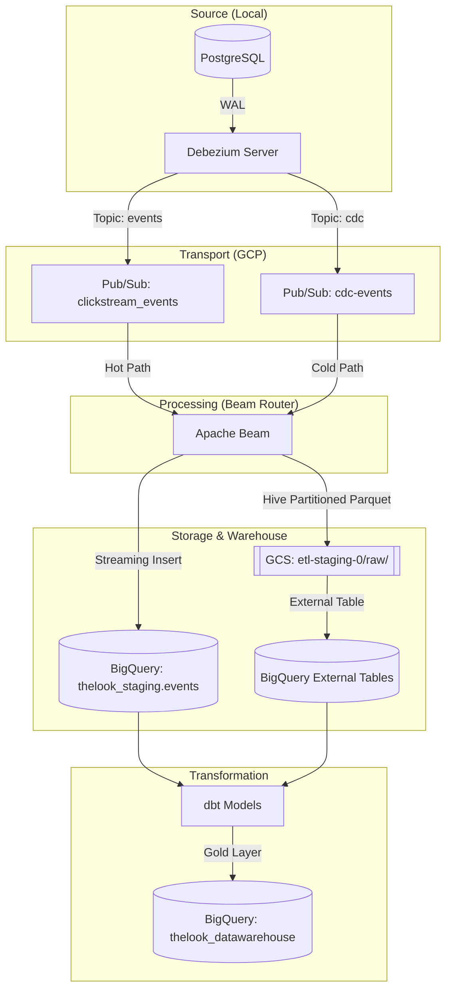

# 📘 Tài liệu Cấu trúc Pipeline DWH (Phiên bản Cải tiến v2)

Tài liệu này cung cấp cái nhìn chi tiết nhất về các thay đổi kỹ thuật, lý do đằng sau các quyết định thiết kế và hướng dẫn vận hành hệ thống CDC Data Pipeline.

---

## 🏗️ 1. Kiến trúc Tổng thể (Visual Workflow)



---

## 🏷️ 2. Chuẩn hóa Naming Convention (Dataset Update)

Chúng ta đã thực hiện đổi tên toàn bộ các dataset trên hệ thống để phản ánh đúng vai trò của từng tầng dữ liệu:
- **`thelook_staging`**: Tầng chứa dữ liệu thô (raw) từ CDC và các External Table. (Thay thế cho `thelook_bronze`).
- **`thelook_datawarehouse`**: Tầng chứa dữ liệu đã qua chuyển đổi (marts, fact, dim). (Thay thế cho `thelook_gold`).

**Các thành phần đã cập nhật chuyên sâu:**
- **Môi trường & Scripts:**
    - `.env`: Cập nhật `BRONZE_DATASET_ID` và `GOLD_DATASET_ID`.
    - `run_local_dataflow.ps1`: Đổi biến `$DATASET` sang `thelook_staging`.
    - `infra/bigquery/setup_bigquery.ps1` & `.sh`: Sửa giá trị mặc định cho tham số Dataset.
- **dbt (Transformation):**
    - `dbt_project.yml`: Cấu hình lại `+dataset` (thay cho `+schema` để tương thích BigQuery adapter).
    - `profiles.yml`: Chỉ định dataset mặc định là `thelook_staging`.
    - `models/sources.yml`: Hardcode schema `thelook_staging` để đảm bảo dbt source nhận diện đúng.
- **Dataflow Logic:**
    - `src/dataflow/beam_router.py`: Cập nhật tham số mặc định `--bronze_dataset`.
- **Dashboard:**
    - `src/dashboard/app.py`: Sửa fallback dataset ID trong hàm `os.getenv()`.

---

## 🚦 3. Chi tiết Cải tiến Kỹ thuật

### 3.1. Phân tách Hot/Cold Routing (Fix lỗi Duplicate)
**Vấn đề cũ:** Logic routing bị chèn lặp (merging) khiến `events` vừa chảy vào BigQuery vừa chảy vào GCS không nhất quán.
**Giải pháp:** 
- Khóa cứng `HOT_TABLES = ['events']` trong `beam_router.py`.
- Chỉ những bảng trong list này mới đi qua `WriteToBigQuery` (Hot).
- Tất cả các bảng còn lại (CDC chính) được dồn qua luồng GCS (Cold).

### 3.2. Chiến lược Deduplication mới (CDC-Aware)
**Vấn đề:** Sử dụng `created_at` để `row_number()` trong dbt sẽ bị sai khi bản ghi được Update. Timestamp thực tế của sự kiện Update là lúc nó được capture bởi Debezium.
**Giải pháp:**
- Sử dụng `cdc_timestamp` (đơn vị microsecond/millisecond từ Debezium) làm cột định danh thời gian thực thi.
- Câu lệnh dbt chuyển sang:
  ```sql
  row_number() over (partition by id order by cdc_timestamp desc)
  ```
- Đảm bảo lấy được Stage mới nhất của Record ngay cả khi `created_at` không đổi (đặc biệt quan trọng cho bảng `orders`).

### 3.3. Fix Schema & Mapping (stg_events)
**Vấn đề:** Model `stg_events` lỗi do tìm cột `event_id` không tồn tại trong BQ streaming table (BQ chỉ có cột `id`).
**Giải pháp:**
- Cập nhật mapping trong `stg_events.sql`: `cast(id as int64) as event_id`.
- Bổ sung `cdc_timestamp` và `cdc_operation` vào tầng staging để phục vụ logic lọc xóa (Hard delete bypass).

### 3.4. Tương thích Debezium Server 2.6
**Vấn đề:** `snapshot.mode=schema_only` bị lỗi command không hợp lệ trên phiên bản 2.6.
**Giải pháp:** Chuyển sang `debezium.source.snapshot.mode=no_data`. Cấu hình này giúp hệ thống bỏ qua việc quét toàn bộ DB cũ (tránh treo máy local) và bắt đầu stream ngay các thay đổi mới nhất.

---

## 🔐 4. Quản trị Quyền hạn (IAM & Security)

Để hệ thống chạy mượt mà, Service Account (`debezium-server-sa`) được cấp các quyền tối thiểu cần thiết:

| Dịch vụ | Role | Lý do |
| :--- | :--- | :--- |
| **GCS** | `roles/storage.admin` | Ghi file Parquet và quản lý thư mục tmp/staging |
| **BigQuery** | `roles/bigquery.jobUser` | Cho phép chạy các job Query/Insert |
| **BigQuery** | `roles/bigquery.dataEditor` | Cho phép ghi dữ liệu vào các bảng Staging |
| **Pub/Sub** | `roles/pubsub.admin` | Tạo/Đọc/Xóa topic và subscription |

---

## 🩺 5. Bảng tra cứu lỗi nhanh (Troubleshooting)

| Lỗi thường gặp | Nguyên nhân | Cách xử lý |
| :--- | :--- | :--- |
| `NoneType object has no attribute close` (dbt) | Lỗi kết nối BigQuery do thiếu `execution_project`. | Thêm `execution_project` vào `profiles.yml` như đã fix. |
| `Table requires a schema` (Beam) | BigQuery không tự đoán được schema khi Streaming Insert. | Khai báo `events_bq_schema` trực tiếp trong `beam_router.py`. |
| `403 Forbidden` | Service Account hết hạn hoặc thiếu quyền. | Chạy lệnh `gcloud projects add-iam-policy-binding` cấp role `jobUser`. |
| `Not Found: Table ... staging.orders` | GCS chưa có file thực tế hoặc Partition chưa flush. | Chờ 5p window flush. Nếu nôn nóng, tạo Table BQ thủ công trỏ vào wildcard `**`. |

---

## 📈 6. Quy trình Vận hành Chuẩn

1. **Khởi động Local:** `docker compose up -d`.
2. **Kiểm tra Debezium:** `docker logs -f debezium-server`. Đảm bảo thấy "Searching for WAL resume position".
3. **Kích hoạt Pipeline:** Chạy `.\run_local_dataflow.ps1`.
4. **Kiểm tra Staging:** Chạy SQL `SELECT count(*) FROM thelook_staging.events` trên BQ Console.
5. **Transform:** Chạy `dbt run` tại folder `dbt/thelook_dwh`.

---
*Tài liệu được cập nhật tự động bởi Antigravity vào ngày 17/04/2026. Mọi thay đổi kiến trúc đều nhắm đến tính toàn vẹn dữ liệu (Data Integrity).*
